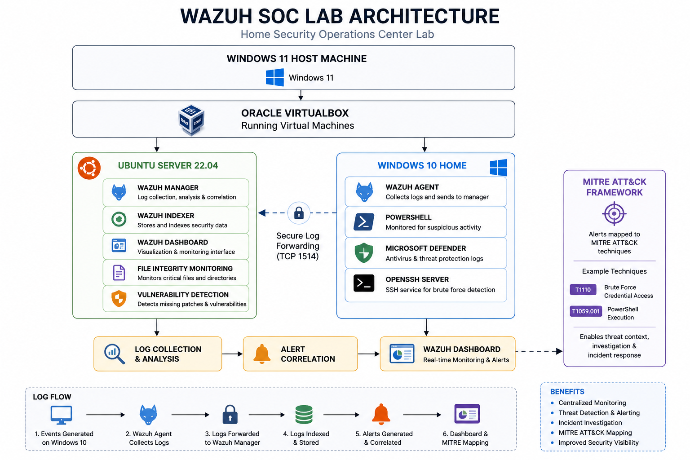

# Wazuh SOC Lab Architecture

## Overview

This diagram illustrates the architecture of my home Security Operations Center (SOC) lab. The lab consists of an Ubuntu Server running the Wazuh platform and a Windows 10 endpoint running the Wazuh Agent. Security events are collected, analyzed, and displayed in the Wazuh Dashboard.

## Architecture Diagram

> *(The architecture image will be added below after creating it.)*

## Components

### Host Machine
- Windows 11
- Oracle VirtualBox

### Ubuntu Server 22.04
- Wazuh Manager
- Wazuh Indexer
- Wazuh Dashboard

### Windows 10 Home
- Wazuh Agent
- Microsoft Defender
- PowerShell
- OpenSSH Server

## Data Flow

1. Security events are generated on the Windows endpoint.
2. The Wazuh Agent collects system and security logs.
3. Logs are securely forwarded to the Wazuh Manager.
4. The Wazuh Manager analyzes and correlates the events.
5. Alerts are displayed in the Wazuh Dashboard.
6. Alerts are mapped to the MITRE ATT&CK framework for investigation.
