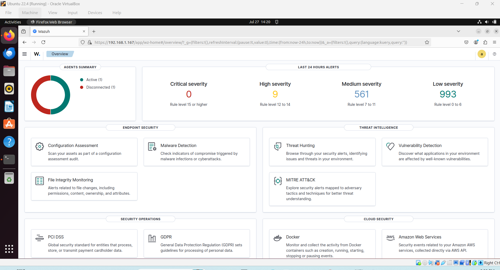

# Wazuh Installation

## Overview

This document explains how I installed and configured the Wazuh Security Information and Event Management (SIEM) platform as the foundation of my home SOC lab.

## Lab Environment

- **Wazuh Version:** 4.12.0
- **Operating System:** Ubuntu Server 22.04 LTS
- **Virtualization Platform:** VirtualBox
- **Endpoint:** Windows 10 Home

## Objectives

- Install the Wazuh Manager
- Access the Wazuh Dashboard
- Prepare the environment for endpoint monitoring
- Build a foundation for future security monitoring and incident response

## Result

The Wazuh Manager was successfully installed and configured. The dashboard became accessible, allowing additional security components such as File Integrity Monitoring, Vulnerability Detection, Windows Defender monitoring, and MITRE ATT&CK mapping to be implemented.

## Dashboard Overview

The Wazuh dashboard was successfully deployed and provides centralized visibility into security events, endpoint status, threat intelligence, file integrity monitoring, vulnerability detection, and MITRE ATT&CK mappings.

