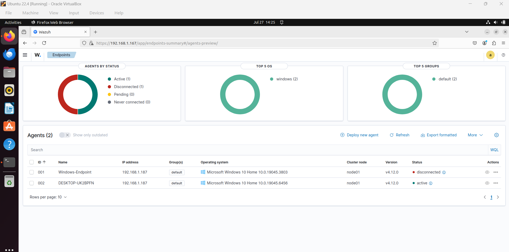
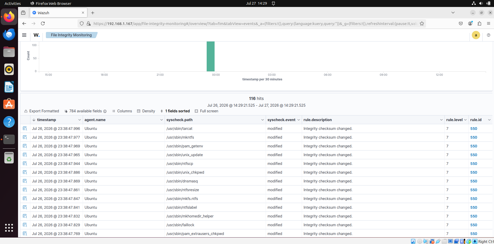
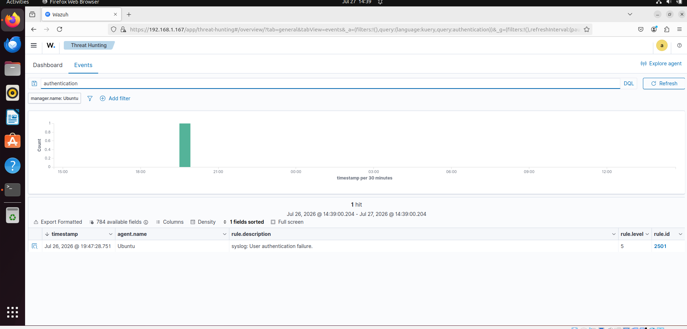
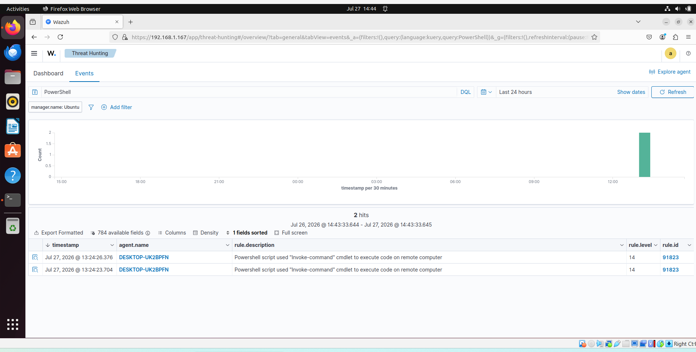
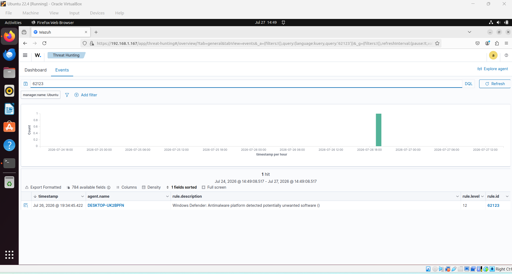
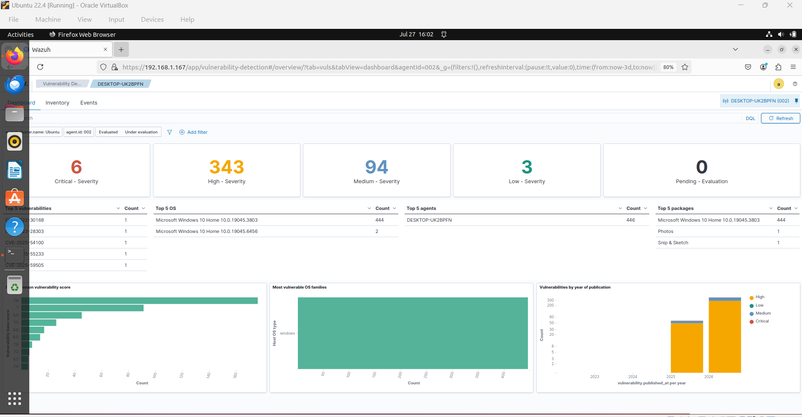
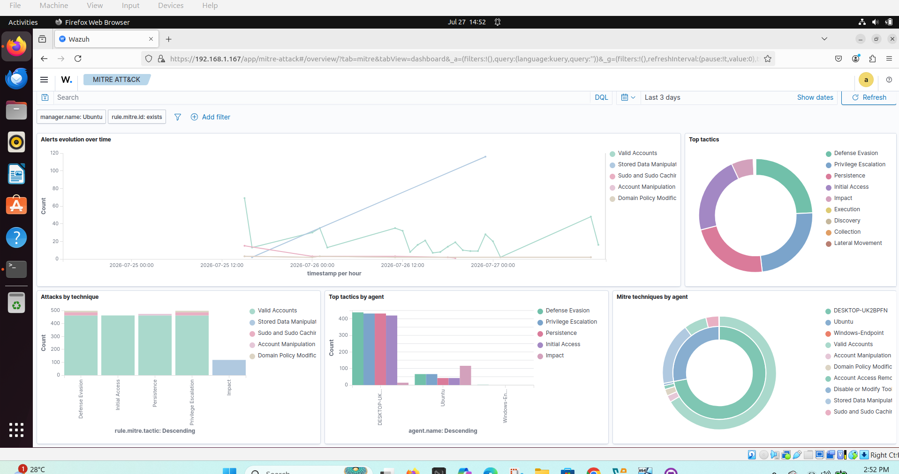

# 🛡️ Wazuh SOC Home Lab

A hands-on Security Operations Center (SOC) home lab built using **Wazuh**, **Ubuntu Server**, and **Windows 10** to simulate real-world security monitoring, threat detection, incident investigation, and endpoint security.

---

## 📖 Project Overview

This project demonstrates the deployment and configuration of a Wazuh-based Security Operations Center (SOC) capable of collecting, analyzing, and visualizing security events from a Windows endpoint.

The lab includes endpoint monitoring, File Integrity Monitoring (FIM), vulnerability detection, PowerShell monitoring, Windows Defender event collection, brute force attack detection, and MITRE ATT&CK mapping.

This project was created to strengthen practical SOC analyst skills and gain hands-on experience with security monitoring and incident response.

---

## 🎯 Objectives

- Deploy a Wazuh SIEM environment
- Monitor Windows endpoints
- Detect security threats
- Investigate security events
- Perform incident response
- Learn MITRE ATT&CK mapping
- Build a practical cybersecurity portfolio

---

## 🛠️ Technologies Used

| Category | Technologies |
|-----------|--------------|
| Operating System | Ubuntu Server 22.04 LTS |
| Endpoint | Windows 10 Home |
| SIEM Platform | Wazuh 4.12 |
| Virtualization | Oracle VirtualBox |
| Security Monitoring | File Integrity Monitoring (FIM) |
| Threat Detection | Brute Force Detection |
| Endpoint Security | Microsoft Defender |
| Logging | PowerShell Operational Logs |
| Framework | MITRE ATT&CK |

---

## 🏗️ Architecture

The architecture of the lab is documented here:

➡️ **[SOC Lab Architecture](Architecture/SOC-Lab-Architecture.md)**

---

## 📂 Repository Structure

```text
Wazuh-SOC-Lab/
│
├── Architecture/
│   ├── SOC-Lab-Architecture.md
│   └── SOC-Lab-Architecture.png
│
├── Documentation/
│   ├── 01-Wazuh-Installation.md
│   ├── 02-Agent-Enrollment.md
│   ├── 03-File-Integrity-Monitoring.md
│   ├── 04-Brute-Force-Detection.md
│   ├── 05-PowerShell-Monitoring.md
│   ├── 06-Windows-Defender.md
│   └── 07-MITRE-ATTACK.md
│
├── Incident-Response/
│   └── Brute-Force-Incident-Report.md
│
├── Screenshots/
│
└── README.md
```

---

## 🧪 Lab Scenarios

The following scenarios were completed during this project:

- ✅ Wazuh Installation
- ✅ Windows Agent Enrollment
- ✅ File Integrity Monitoring
- ✅ Brute Force Detection
- ✅ PowerShell Monitoring
- ✅ Windows Defender Monitoring
- ✅ Vulnerability Detection
- ✅ MITRE ATT&CK Investigation
- ✅ Incident Response Documentation

---

## 📸 Dashboard Screenshots

| Feature | Screenshot |
|---------|------------|
| Wazuh Overview |  |
| Registered Agent |  |
| File Integrity Monitoring |  |
| Authentication Failure |  |
| PowerShell Detection |  |
| Windows Defender Detection |  |
| Vulnerability Detection |  |
| MITRE ATT&CK Dashboard |  |

---

## 🚨 Detection Capabilities

This lab demonstrates the ability to detect:

- Unauthorized file modifications
- Brute force authentication attempts
- PowerShell execution
- Microsoft Defender security events
- Vulnerable software
- Windows endpoint activity
- MITRE ATT&CK techniques

---

## 📋 Incident Response

A sample incident investigation was completed for a simulated brute force attack.

📄 **Incident Report**

- [Brute Force Incident Report](Incident-Response/Brute-Force-Incident-Report.md)

---

## 🧠 MITRE ATT&CK

The lab uses Wazuh's built-in MITRE ATT&CK integration to map security alerts to attacker tactics and techniques.

Example mappings include:

| Technique ID | Technique | Tactic |
|--------------|-----------|--------|
| T1059.001 | PowerShell | Execution |
| T1110 | Brute Force | Credential Access |

---

## 💻 Skills Demonstrated

This project demonstrates practical experience with:

- Security Information and Event Management (SIEM)
- Endpoint Detection and Monitoring
- Windows Event Log Analysis
- File Integrity Monitoring
- Security Alert Investigation
- Incident Response
- Threat Detection
- MITRE ATT&CK Framework
- Ubuntu Server Administration
- Windows Administration
- Log Analysis
- Technical Documentation

---

## 🚀 Future Improvements

Future enhancements include:

- Active Directory integration
- Linux endpoint monitoring
- Sysmon deployment
- Custom Wazuh detection rules
- Email alerting
- Threat intelligence integration
- Additional attack simulations

---

## 👨‍💻 Author

**Adnan Ahmed**

Computer Science & Information Security Graduate

CompTIA Security+

Aspiring SOC Analyst | Cybersecurity Analyst

---

⭐ If you found this project helpful or interesting, feel free to star the repository.